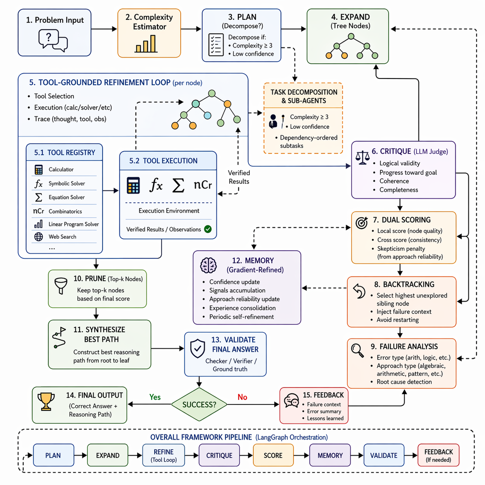
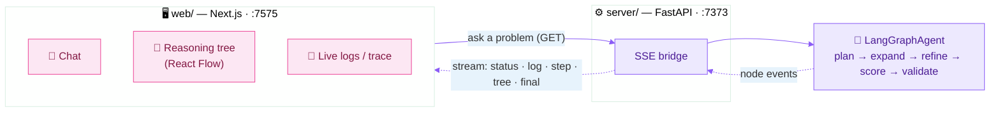

# 🌳 ReTreVal — Reasoning Tree with Validation

<div align="center">

**Watch an LLM grow a validated reasoning tree, refine each node with tools, and remember what works — live.**

[](https://arxiv.org/pdf/2601.02880)
[](LICENSE)
[](https://langchain-ai.github.io/langgraph/)
[](web/)
[](https://www.python.org/)

[Demo](#-demo) · [Mission](#-mission) · [Why](#-why-retreval) · [How it works](#-how-it-works) · [Web UI](#-web-ui) · [Quickstart](#-quickstart) · [Results](#-results)

</div>

---

## 🎬 Demo

<!-- GitHub renders the uploaded .mp4 below as an inline click-to-play player (with sound).
     On GitLab/other viewers it shows as a link; the GIF + screenshot are the fallback. -->

https://github.com/user-attachments/assets/2e0d87ff-4634-432c-bda8-de0f52002677

<div align="center"><sub><i>▶︎ Click to play (with sound) — two prompts, two domains. &nbsp;·&nbsp; Silent GIF: <a href="docs/demo.gif">docs/demo.gif</a> &nbsp;·&nbsp; Full MP4: <a href="docs/demo.mp4">docs/demo.mp4</a> &nbsp;·&nbsp; <a href="docs/screenshot.png">screenshot</a></i></sub></div>

> **Two prompts, two domains** — number theory (*divisors of 196*) and deep learning (*the GELU formula*) — each solved live: the agent **plans** a tree, **expands** candidate approaches, **refines** each with tools (`python_exec`, `calculator`, `arxiv_search`, `wikipedia`…), **scores** them, **backtracks** out of dead ends, and **remembers** what worked. Every step streams to the UI in real time.

---

## 🎯 Mission

> **Build an agent that learns.** Most reasoning frameworks run each problem cold; ReTreVal accumulates what worked and what failed across runs and feeds it into every new attempt — one pipeline, any task, continuously improving, no fine-tuning.

---

## 🤔 Why ReTreVal

ReTreVal treats reasoning as **search with feedback** — explore candidate paths as a tree, validate and prune them, then remember the outcome for next time. Concretely, that means:

- 🌳 **Tree + validation, not just a chain** — candidates are explored as a branching tree, each scored by self-eval **and** an external LLM critic; the best path advances.
- 🛠️ **Tools at every node** — a ReAct loop lets the model call a calculator, equation solver, `python_exec`, and web/Wikipedia/arXiv search to *verify* its reasoning instead of guessing.
- 🧠 **Memory that compounds** — successful patterns and failure modes persist to disk and are injected into future problems; performance improves with scale, not just with a better model.
- 🔁 **Backtracking** — on a failed validation the agent navigates to an unexplored sibling with structured failure context, instead of giving up.
- 🧩 **Task-agnostic** — the same graph works across math, science, multiple-choice, and open-ended tasks; plug in a new evaluator, not a new agent.
- ⚡ **Four backends, one interface** — Gemini, OpenAI, Ollama, and vLLM behind a provider-agnostic facade; swap with an env var.
- 🔍 **Auditable** — every node, score, tool call, and memory write is inspectable; the web UI renders the whole tree and trace.

---

## 🧠 How it works

ReTreVal is a compiled [LangGraph](https://langchain-ai.github.io/langgraph/) state graph. For each problem it grows an **adaptive reasoning tree** whose depth/branching scale with estimated complexity. Each node self-improves through a **tool-augmented ReAct loop**, is scored by **dual validation** (`0.6 × local self-eval + 0.4 × external critic`), and on validation failure performs **typed-failure backtracking**. Hard problems are **decomposed** into sub-tasks. A persistent **memory** feeds past successes and failures into every new attempt.

<div align="center"></div>

| Step | What happens |
|---|---|
| **Plan** | Estimate complexity (1–5) and size the tree (depth/branching) adaptively; inject relevant memory. |
| **Expand** | Generate K candidate reasoning branches from the current node. |
| **Tool-augmented refine** | Each node runs a ReAct loop where the LLM calls tools (calculator, equation solver, `python_exec`, web/Wikipedia/arXiv) to verify and improve its reasoning. |
| **Critique + dual score** | Pairwise cross-critique plus local self-eval, combined as `0.6 × local + 0.4 × cross`; the best branch advances. |
| **Memory update** | Insights and failure patterns are written back (de-duplicated, confidence-weighted) for future problems. |
| **Decompose** | Hard problems (complexity ≥ 4, low score) are split into dependency-ordered sub-tasks, solved, and aggregated. |
| **Synthesize → Validate** | Produce the final answer and validate it. By default the agent solves *without* seeing the reference answer; pass `--oracle` to let it use the reference (research only). |
| **Backtrack** | On validation failure, navigate to an unexplored sibling branch with structured failure context injected. |

### How the memory works

The memory (`src/utils/memory.py`, class `Memory`) is a persistent buffer of structured entries — **insights**/**successes** (patterns that produced correct answers) and **failures** (what went wrong and why). Each entry carries a confidence score, and new entries are de-duplicated against existing ones by keyword (Jaccard) overlap rather than stored blindly. After every problem the outcome is written back, confidence is nudged up on success / down on failure, and the buffer is serialized to a human-readable `memory.md` (with an embedded JSON block for exact reload).

On the next problem the **most relevant** entries — ranked by keyword overlap × confidence — are injected into the prompts. The buffer persists across runs via that shared file, so a fresh batch picks up everything the previous batch learned. Memory is on by default; point it at a file with `--memory-file <path>` (or `MEMORY_FILE`), or disable it with `--no-memory`.

---

## 🖥️ Web UI

A chat where you can **watch the agent think**. Type a problem on the left; on the right the **reasoning tree** grows node-by-node and the **trace** streams live — then the validated answer (with rendered math/code) lands back in the chat.



### Run it

```bash
# 1 — backend bridge.  Mock mode = no API key, streams a deterministic demo run.
cd retreval_oss && . .venv/bin/activate
pip install -r server/requirements.txt
RETREVAL_MOCK=1 uvicorn server.app:app --port 7373

# 2 — UI (in a second shell)
cd web && npm install && npm run dev          # → http://localhost:7575
```

Open **http://localhost:7575**. To drive the **real agent** instead of the mock,
configure a provider in `.env` (e.g. `LLM_PROVIDER=gemini`, `GEMINI_API_KEY=…`)
and start the backend **without** `RETREVAL_MOCK`. The UI auto-detects which
provider the backend is using.

### Using it

- **Ask anything** — type a problem and press **Enter**, or click a suggested example. It's domain-general: math, science, coding, knowledge, or open-ended all work.
- **Watch the tree** *(right, top)* — every node is a candidate approach, **colored by score**; the **★ pink** node is the current best and the highlighted edge is the active path. Drag to pan, scroll to zoom.
- **Follow the trace** *(right, bottom)* — `plan → expand → tool-refine → score → backtrack → synthesize → validate`, with each tool call (`calculator`, `python_exec`, `arxiv_search`, `wikipedia`…) and memory write streaming in.
- **Tune the run** *(top bar)* — choose the **provider**, set **iterations** (how many tree passes), toggle **memory**, and switch **🌙 / ☀️** themes.
- **Resize / focus** — drag the divider to resize the panes, **double-click** it to reset to 50/50, or hit **✕** to collapse the panel for a distraction-free chat.

> Ports are chosen to be memorable and browser-safe: **UI `7575`**, **API `7373`**.

Build a static bundle for deployment with `npm run build` (outputs `web/out/`, serve with any static host). More detail in [`web/README.md`](web/README.md).

---

## 🚀 Quickstart

```bash
# 1 — clone and install
git clone https://github.com/qpiai/retreval.git && cd retreval
python -m venv .venv && source .venv/bin/activate
pip install -r requirements.txt

# 2 — configure a provider
cp .env.example .env
# set LLM_PROVIDER and your API key in .env
```

```bash
# 3 — solve a single problem
python -m src.agents.agent_main \
  --provider gemini \
  --prompt "How many positive whole-number divisors does 196 have?" \
  --iterations 2 --verbose

# 4 — evaluate on MATH-500 (memory persists across runs)
python -m src.agents.math500_eval --provider gemini --limit 100 --iterations 1

# 5 — summarize a run
python analyze_results.py            # newest run in results/math500/
```

Results land in `results/math500/math500_eval_YYYYMMDD_HHMMSS.jsonl`. Run the evaluator again on the next batch — the memory from the first carries over automatically.

---

## 📊 Results

*From the paper ([arXiv 2601.02880](https://arxiv.org/pdf/2601.02880)).*

**🎯 85.8% accuracy on MATH-500** (429/500), **+7.2 pp over Self-Refine** — and **54.4%** on MMLU-Pro. Ablations confirm each component pulls its weight: removing memory drops accuracy to 76.8%, removing backtracking to 78.4%.

A second view — answer *quality* judged 0–10 by an independent LLM (vs. the baselines):

| Method | Avg Score | Median | High Quality (≥ 7) | Failures |
|---|---|---|---|---|
| Reflexion | 3.93 | 3.0 | 24.2 % | 107 |
| Self-Refine | 6.56 | 6.0 | 44.6 % | 2 |
| ReAct | 6.63 | 7.0 | 51.6 % | 3 |
| **ReTreVal** | **6.92** | **8.0** | **58.0 %** | **0** |

ReTreVal is the only method with **zero** complete failures across 500 problems.

> **Reproducibility note.** The bundled `math500_eval.py` reports **exact-match accuracy** (the 85.8% metric — fast, deterministic, no extra API cost). The 0–10 *judged* scores in the table come from the paper's separate LLM-judge harness; see the paper for that protocol.

---

## 🔌 Supported tasks

The OSS release ships a **MATH-500 evaluator** as the reference implementation; the agent itself is task-agnostic. The framework has been evaluated on MATH-500, GSM8K, GPQA, and creative writing. Adding a task needs two things: a **loader** (yields `(question, expected_answer)`) and an **answer normalizer** — everything else stays the same.

---

## 🧩 Repository layout

```text
.
├── src/
│   ├── agents/        # LangGraph tree agent, per-node ReAct executor, CLI, MATH-500 eval
│   ├── tools/         # planner, refiner+critique, dual scoring, feedback/backtrack,
│   │                  #   decomposition, synthesis, computation, search
│   ├── clients/       # provider router + Gemini / OpenAI / Ollama / vLLM backends
│   └── utils/         # persistent Memory + vLLM KV-cache prompt structuring
├── web/               # Next.js chat UI (chat · reasoning tree · live logs)
├── server/            # FastAPI bridge — streams the agent to the UI over SSE
├── scripts/           # headless-browser smoke test for the UI
├── docs/              # demo.mp4 / demo.gif / screenshot.png
├── data/math/         # bundled MATH-500 dataset
├── results/math500/   # evaluation outputs (JSONL, timestamped)
├── analyze_results.py # summarize a MATH-500 run (accuracy, by level/subject)
├── run_math500_vllm.py
├── .env.example
└── requirements.txt
```

---

## ⚙️ Configuration

<details>
<summary><b>LLM provider — no code changes to switch backends</b></summary>

```env
# Cloud
LLM_PROVIDER=gemini
GEMINI_API_KEY=...
GEMINI_MODEL=gemini-2.5-flash        # or gemini-2.5-pro

LLM_PROVIDER=openai
OPENAI_API_KEY=...
OPENAI_MODEL=gpt-4o-mini             # or gpt-4o

# Local
LLM_PROVIDER=ollama
OLLAMA_BASE_URL=http://localhost:11434
OLLAMA_MODEL=qwen2.5:7b

LLM_PROVIDER=vllm
VLLM_BASE_URL=http://localhost:8000/v1
VLLM_MODEL=Qwen/Qwen2.5-7B-Instruct
```

| Provider | Best for | Suggested models |
|---|---|---|
| **Gemini** | Free tier, strong reasoning | `gemini-2.5-flash`, `gemini-2.5-pro` |
| **OpenAI** | GPT-4o quality bar | `gpt-4o-mini`, `gpt-4o` |
| **Ollama** | On-premise, privacy | `qwen2.5:7b`, `llama3.1:8b` |
| **vLLM** | High-throughput local batch eval | `Qwen/Qwen2.5-7B-Instruct`, any HF repo |

</details>

<details>
<summary><b>Agent and memory settings</b></summary>

```env
MAX_OUTPUT_TOKENS=2048
TEMPERATURE=0.7
MAX_DEPTH=5              # tree-depth cap (planner sets the adaptive value)
CHILDREN_PER_EXPANSION=3

MEMORY_FILE=memory.md    # shared cross-problem memory file (default: <repo>/memory.md)
```

Memory is enabled by default. Override the file per run with `--memory-file <path>`, or turn it off with `--no-memory` (both `agent_main` and `math500_eval` accept these flags).

</details>

<details>
<summary><b>vLLM KV-cache prefix optimization</b></summary>

Start vLLM with prefix caching, then run the convenience wrapper:

```bash
vllm serve Qwen/Qwen2.5-7B-Instruct --enable-prefix-caching
python run_math500_vllm.py --provider vllm --limit 100
```

The vLLM client structures prompts so the system message and problem context are identical across calls within a problem, so vLLM's automatic prefix caching reuses those KV entries.

</details>

---

## 🗺️ Roadmap

1. **Plug-in task interface** — a formal `Task` / `Evaluator` protocol so contributors can add GPQA and ARC without touching the agent.
2. **Embedding-based memory retrieval** — replace keyword (Jaccard) overlap with semantic search.
3. **Bundle the LLM-judge eval** so the paper's judged scores are reproducible from the repo.
4. **Docker image** — zero-setup container with Ollama + ReTreVal + the UI pre-wired.

Follow along — and please share ideas — in [Issues](../../issues).

---

## 🔗 Related work

[Tree-of-Thoughts](https://arxiv.org/abs/2305.10601) · [ReAct](https://arxiv.org/abs/2210.03629) · [Reflexion](https://arxiv.org/abs/2303.11366) · [Self-Refine](https://arxiv.org/abs/2303.17651)

## 🙏 Thanks

ReTreVal stands on the shoulders of these wonderful projects — thank you to their authors and communities:

[LangGraph](https://langchain-ai.github.io/langgraph/) · [MATH-500](https://huggingface.co/datasets/HuggingFaceH4/MATH-500) · [Google Gemini](https://ai.google.dev/gemini-api/docs) · [OpenAI](https://platform.openai.com/docs) · [Ollama](https://ollama.com/) · [vLLM](https://docs.vllm.ai/) · [Next.js](https://nextjs.org/) · [React Flow](https://reactflow.dev/).

Maintainers and contributors are listed in [AUTHORS.md](AUTHORS.md).

---

## 🤝 Contributing · ⭐ Star · 📄 License

Contributions are very welcome — please see [CONTRIBUTING.md](CONTRIBUTING.md) to get started. The most helpful right now: new task evaluators (GPQA, ARC), the LLM-judge eval harness, and memory retrieval strategies. If ReTreVal is useful to you, a ⭐ would mean a lot — and thank you for taking a look.

Copyright 2026 QPIAI. Released under the [Apache License 2.0](LICENSE).
