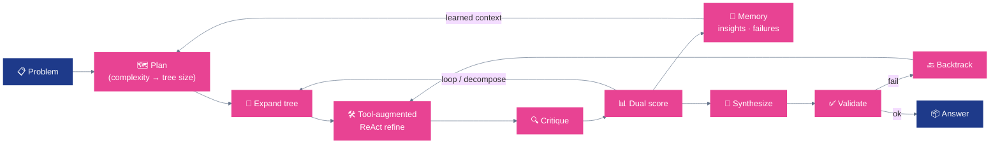

# ReTreVal: Reasoning Tree with Validation

<div align="center">

### 📄 [ReTreVal: Reasoning Tree with Validation — arXiv 2601.02880](https://arxiv.org/pdf/2601.02880)

</div>

---

**A general LLM reasoning framework that gets smarter with every run.**

[](https://arxiv.org/pdf/2601.02880)
[](LICENSE)
[](https://langchain-ai.github.io/langgraph/)
[](https://www.python.org/)

---

## 🎯 Mission

> **Build an agent that learns.**
> Most reasoning frameworks run each problem cold. ReTreVal combines tree-structured exploration with a persistent validation and memory loop — accumulating successful strategies and failure patterns across runs and injecting that context into every new attempt. One pipeline, any task, continuously improving.

---

## Why ReTreVal

Most LLM reasoning frameworks are stateless — every problem starts from scratch. ReTreVal is different. It constructs a tree of candidate reasoning paths, scores each node with dual local + cross validation, prunes aggressively, and writes what worked and what failed into a reflexion buffer. The next problem is attempted with that context already in the prompt. Over hundreds of runs, the agent measurably improves on its own weak spots — no fine-tuning required.

- **Memory that compounds** — successful reasoning paths and failure modes are captured in a reflexion buffer and reused across problems; performance improves with scale, not just with a better model
- **Tree + validation, not just a chain** — candidate solutions are explored as a branching tree, scored by both self-evaluation and an external LLM critic, and the best path is selected before finalizing
- **Task-agnostic pipeline** — the same Draft → Refine → Finalize graph works across math, science, multiple-choice, creative writing, and code; plug in a new evaluator, not a new agent
- **Zero complete failures** — no run produces an empty or malformed answer (vs. 2–107 failures across baselines on MATH-500)
- **58 % high-quality answers on MATH-500** — scored ≥ 7/10 by an independent LLM judge (vs. 51.6 % for ReAct, 44.6 % for Self-Refine)
- **Auditable by default** — every state transition is recorded in `trace`; replay or diff any run from a single JSON file
- **Four backends, one interface** — Gemini, OpenAI, Ollama, and vLLM behind a provider-agnostic facade; swap with an env var

---

## 📊 Results

### MATH-500 — Reasoning Quality (500 problems, 0–10 LLM-judged score)

| Method | Avg Score | Median | High Quality (≥ 7) | Failures |
|---|---|---|---|---|
| Reflexion | 3.93 | 3.0 | 24.2 % | 107 |
| Self-Refine | 6.56 | 6.0 | 44.6 % | 2 |
| ReAct | 6.63 | 7.0 | 51.6 % | 3 |
| **ReTreVal** | **6.92** | **8.0** | **58.0 %** | **0** |

Scores are assigned by an independent LLM evaluator per problem. ReTreVal is the only method with zero failures across 500 problems. Full results are in the [paper](https://arxiv.org/pdf/2601.02880).

---

## 🧠 Architecture

ReTreVal is a compiled [LangGraph](https://langchain-ai.github.io/langgraph/) state graph that, for each problem, grows an **adaptive reasoning tree** whose depth/branching scale with estimated complexity. Each node self-improves through a **tool-augmented ReAct loop** (calculator, Python, equation solver, search…), is scored by **dual validation** (`0.6 × local self-eval + 0.4 × external critic`), and on validation failure the agent performs **typed-failure backtracking** to an unexplored sibling. Hard problems are **decomposed** into sub-tasks. A persistent **memory** feeds past successes and failures into every new attempt.

<div align="center">



</div>

### Pipeline steps

| Step | What happens |
|---|---|
| **Plan** | Estimate complexity (1–5) and size the tree (depth/branching) adaptively; inject relevant memory. |
| **Expand** | Generate K candidate reasoning branches from the current node. |
| **Tool-augmented refine** | Each node runs a ReAct loop where the LLM calls tools (calculator, equation solver, `python_exec`, web/Wikipedia/arXiv) to verify and improve its reasoning. |
| **Critique + dual score** | Pairwise cross-critique plus local self-eval, combined as `0.6 × local + 0.4 × cross`; the best branch advances. |
| **Memory update** | Insights and failure patterns are written back (de-duplicated, confidence-weighted) for future problems. |
| **Decompose** | Hard problems (complexity ≥ 4, low score) are split into dependency-ordered sub-tasks, solved, and aggregated. |
| **Synthesize → Validate** | Produce the final answer and validate it. By default the agent solves without seeing the reference answer, so backtracking triggers on its own score; pass `--oracle` to let it use the reference answer (research only). |
| **Backtrack** | On validation failure, navigate to an unexplored sibling branch with structured failure context injected. |

### How the memory works

The memory (`src/utils/memory.py`, class `Memory`) is a persistent buffer of structured entries in three categories — **insights** and **successes** (patterns that produced correct answers) and **failures** (what went wrong and why). Each entry carries a confidence score, and new entries are de-duplicated against existing ones by keyword (Jaccard) overlap rather than stored blindly. After every problem the outcome is written back, confidence is nudged up on success / down on failure, and the buffer is serialized to a human-readable `memory.md` (with an embedded JSON block for exact reload).

On the next problem the **most relevant** entries — ranked by keyword overlap with the current question × confidence — are injected into both the draft and refine prompts: *"Relevant lessons from previous problems (use the insights, avoid the failures)..."* The buffer persists across runs via that shared file, so a fresh batch picks up everything the previous batch learned, and performance on hard domains measurably improves over multi-hundred-problem runs without any weight updates.

Memory is on by default. Point it at a specific file with `--memory-file <path>` (or the `MEMORY_FILE` env var); disable it entirely with `--no-memory`.

---

## 🔌 Supported Tasks

The OSS release ships with a **MATH-500 evaluator** as the reference implementation. The agent itself is task-agnostic — it takes a question, produces an answer, and optionally compares against ground truth. The same framework has been evaluated on:

| Task | Domain | Format |
|---|---|---|
| **MATH-500** | Competition math | Free-form, LaTeX answer |
| **GSM8K** | Grade-school math | Numerical answer |
| **GPQA** | Graduate-level science QA | Multiple-choice |
| **Creative Writing** | Narrative generation | Open-ended text |

Adding a new task requires two things: a **loader** (yields `(question, expected_answer)` pairs) and an **answer normalizer** (domain-specific string comparison). Everything else — the agent, the memory, the backends — stays the same.

---

## 🚀 Quick Start

```bash
# 1 — clone and install
git clone https://github.com/your-org/retreval.git && cd retreval
python -m venv .venv && source .venv/bin/activate
pip install -r requirements.txt

# 2 — configure a provider
cp .env.example .env
# set LLM_PROVIDER and your API key in .env
```

```bash
# 3 — run the agent on a single problem
python -m src.agents.agent_main \
  --provider gemini \
  --prompt "How many positive whole-number divisors does 196 have?" \
  --iterations 2 \
  --verbose

# 4 — evaluate on MATH-500 (memory is active and persists across runs)
python -m src.agents.math500_eval \
  --provider gemini \
  --limit 100 \
  --iterations 1
```

Results land in `results/math500/math500_eval_YYYYMMDD_HHMMSS.jsonl`. Run the evaluator again on the next 100 problems — the reflexion memory from the first batch carries over automatically.

---

## 🧩 Repository Layout

```text
.
├── src/
│   ├── agents/
│   │   ├── agent_langgraph.py        # LangGraph tree agent (plan→expand→refine→score→backtrack)
│   │   ├── tool_augmented_executor.py # Per-node ReAct tool-use loop
│   │   ├── state.py                  # Shared AgentState
│   │   ├── agent_main.py             # CLI for single-problem solving
│   │   └── math500_eval.py           # Reference evaluator for MATH-500
│   ├── tools/
│   │   ├── registry.py               # ToolSpec / ToolRegistry
│   │   ├── planning.py               # Adaptive tree planner
│   │   ├── refinement.py             # Refiner + cross-critique
│   │   ├── scoring.py                # Dual scoring + memory + complexity
│   │   ├── feedback.py               # Validation, failure analysis, backtracking
│   │   ├── decomposition.py          # Task decomposer + sub-agents
│   │   ├── synthesis.py              # Final answer synthesis
│   │   ├── computation.py            # Calculator, equation solver, python_exec, …
│   │   └── search.py                 # SearchTool (tree expand) + web/Wikipedia/arXiv
│   ├── clients/
│   │   ├── llm_client.py             # Provider router (strategy pattern)
│   │   ├── gemini_client.py          # Google Gemini backend
│   │   ├── openai_client.py          # OpenAI GPT backend
│   │   ├── ollama_client.py          # Local Ollama backend
│   │   └── vllm_client.py            # vLLM backend + KV cache prefix optimization
│   └── utils/
│       ├── memory.py                 # Persistent cross-problem memory (class Memory)
│       └── kv_cache_manager.py       # vLLM prefix-cache prompt structuring
├── data/
│   └── math/
│       └── math_500_test_with_answers.csv   # Bundled MATH-500 dataset
├── results/
│   └── math500/                 # Evaluation outputs (JSONL, timestamped)
├── analyze_results.py           # Compare runs across methods and checkpoints
├── run_math500_vllm.py          # vLLM convenience wrapper
├── run_math500_vllm_kvcache_10.py  # vLLM + prefix caching (30–50 % faster)
├── .env.example
└── requirements.txt
```

---

## ⚙️ Configuration

<details>
<summary><b>LLM provider — no code changes to switch backends</b></summary>

```env
# Cloud
LLM_PROVIDER=gemini
GEMINI_API_KEY=...
GEMINI_MODEL=gemini-2.5-flash        # or gemini-2.5-pro

LLM_PROVIDER=openai
OPENAI_API_KEY=...
OPENAI_MODEL=gpt-4o-mini             # or gpt-4o

# Local
LLM_PROVIDER=ollama
OLLAMA_BASE_URL=http://localhost:11434
OLLAMA_MODEL=qwen2.5:7b

LLM_PROVIDER=vllm
VLLM_BASE_URL=http://localhost:8000/v1
VLLM_MODEL=Qwen/Qwen3.5-9B
```

| Provider | Best for | Suggested models |
|---|---|---|
| **Gemini** | Free tier, strong reasoning | `gemini-2.5-flash`, `gemini-2.5-pro` |
| **OpenAI** | GPT-4o quality bar | `gpt-4o-mini`, `gpt-4o` |
| **Ollama** | On-premise, privacy | `qwen2.5:7b`, `llama3.1:8b` |
| **vLLM** | High-throughput local batch eval | `Qwen/Qwen3.5-9B`, any HF repo |

</details>

<details>
<summary><b>Agent and memory settings</b></summary>

```env
MAX_OUTPUT_TOKENS=2048
TEMPERATURE=0.7
MAX_REFINEMENTS=3        # refinement passes per problem

MEMORY_FILE=memory.md    # shared cross-problem memory file (default: <repo>/memory.md)
```

Memory is enabled by default. Override the file per run with `--memory-file <path>`, or turn it
off with `--no-memory` (both `agent_main` and `math500_eval` accept these flags).

</details>

<details>
<summary><b>vLLM KV cache prefix optimization</b></summary>

Start vLLM with prefix caching:

```bash
vllm serve Qwen/Qwen3.5-9B --enable-prefix-caching
```

The vLLM client structures prompts so the system message and problem context are identical across Draft, Refine, and Finalize calls within the same problem. vLLM's automatic prefix caching reuses those KV entries, cutting per-problem inference cost by 30–50 %.

```bash
python run_math500_vllm_kvcache_10.py --provider vllm --limit 100
```

</details>

---

## 🗺️ Roadmap

1. **Plug-in task interface** — publish a formal `Task` and `Evaluator` protocol so community contributors can add GPQA and ARC evaluators without touching the agent
2. **Embedding-based memory retrieval** — replace keyword (Jaccard) overlap with semantic search so the agent surfaces the *most relevant* past failures, not just the closest by keyword
3. **Streaming trace** — surface tree expansion, tool calls, and memory-update steps in real time via SSE
4. **Docker image** — zero-setup container with Ollama + ReTreVal pre-configured
5. **HuggingFace Spaces** — hosted demo with public leaderboard

Follow along in [Issues](../../issues).

---

## 🔗 Related Work

ReTreVal builds on and benchmarks against:

[Tree-of-Thoughts](https://arxiv.org/abs/2305.10601) · [ReAct](https://arxiv.org/abs/2210.03629) · [Reflexion](https://arxiv.org/abs/2303.11366) · [Self-Refine](https://arxiv.org/abs/2303.17651)

---

## 🙏 Thanks

[LangGraph](https://langchain-ai.github.io/langgraph/) · [Hugging Face](https://huggingface.co/) · [MATH-500](https://huggingface.co/datasets/HuggingFaceH4/MATH-500) · [Google Gemini](https://ai.google.dev/gemini-api/docs) · [OpenAI](https://platform.openai.com/docs) · [Ollama](https://ollama.com/) · [vLLM](https://docs.vllm.ai/)

Contributors listed in [AUTHORS.md](AUTHORS.md).

---

## 🤝 Contributing · ⭐ Star · 📄 License

Fork, build, PR — see [CONTRIBUTING.md](CONTRIBUTING.md). The highest-value contributions right now are new task evaluators (GPQA, ARC) and memory retrieval strategies.

If ReTreVal is useful to you, a ⭐ helps others find it.

Copyright 2026 QPIAI. Released under the [Apache License 2.0](LICENSE).
