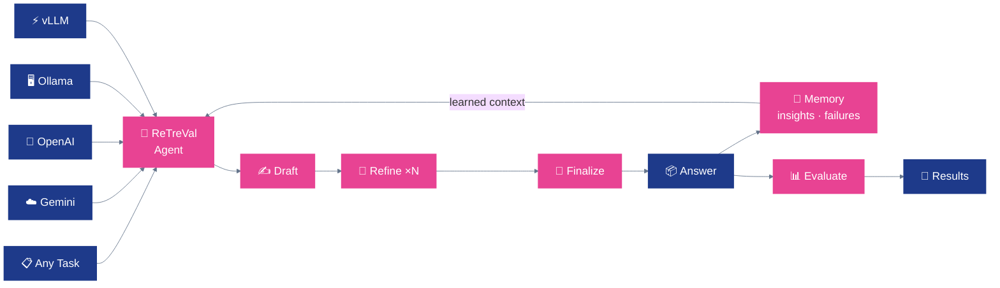

# ReTreVal

**A general LLM reasoning framework that gets smarter with every run.**

[](LICENSE)
[](https://arxiv.org/pdf/2601.02880)
[](https://langchain-ai.github.io/langgraph/)
[](https://www.python.org/)

---

## 🎯 Mission

> **Build an agent that learns.**
> Most reasoning frameworks run each problem cold. ReTreVal accumulates successful strategies and failure patterns across runs, injecting that memory into every new attempt. One pipeline, any task, continuously improving.

---

## Why ReTreVal

Most LLM reasoning frameworks are stateless — every problem starts from scratch. ReTreVal is different. After each run, it writes what worked and what failed into a persistent memory buffer. The next problem is attempted with that context already in the prompt. Over hundreds of runs, the agent measurably improves on its own weak spots.

- **Memory that compounds** — successful reasoning paths and failure modes are captured in a reflexion buffer and reused across problems, without any fine-tuning
- **Task-agnostic pipeline** — the same Draft → Refine → Finalize graph works across math, science, multiple-choice, creative writing, and code; swap the evaluator, not the agent
- **Zero complete failures** — no run produces an empty or malformed answer (vs. 2–107 failures across baselines on MATH-500)
- **58 % high-quality answers on MATH-500** — scored ≥ 7/10 by an independent LLM judge (vs. 51.6 % for ReAct, 44.6 % for Self-Refine)
- **Auditable by default** — every state transition is recorded in `trace`; replay or diff any run from a single JSON file
- **Four backends, one interface** — Gemini, OpenAI, Ollama, and vLLM behind a provider-agnostic facade; swap with an env var

---

## 📊 Results

Evaluated across mathematical reasoning, science QA, multiple-choice benchmarks, and creative generation. See the [paper](https://arxiv.org/pdf/2601.02880) for full details on GPQA, MMLU, and ScienceWorld. Summary of key benchmarks below.

### MATH-500 — Reasoning Quality (500 problems, 0–10 LLM-judged score)

| Method | Avg Score | Median | High Quality (≥ 7) | Failures |
|---|---|---|---|---|
| Reflexion | 3.93 | 3.0 | 24.2 % | 107 |
| Self-Refine | 6.56 | 6.0 | 44.6 % | 2 |
| ReAct | 6.63 | 7.0 | 51.6 % | 3 |
| **ReTreVal** | **6.92** | **8.0** | **58.0 %** | **0** |

### GSM8K — Exact Match Accuracy (1,319 problems)

| Method | Accuracy |
|---|---|
| ReAct | 92.8 % |
| **ReTreVal** | **93.9 %** |
| Reflexion | 94.3 % |

### Creative Writing — Multi-Metric Quality (100 tasks, 1–10 per axis)

| Method | Correctness | Meaning | Creativity | Avg |
|---|---|---|---|---|
| Reflexion | 6.43 | 5.94 | 6.78 | 6.38 |
| Self-Refine | 6.45 | 5.94 | 6.78 | 6.39 |
| ReAct | 8.06 | 6.32 | 7.16 | 7.18 |
| **ReTreVal** | **9.62** | **6.90** | **7.12** | **7.88** |

### Per-domain accuracy on MATH-500 (with reflexion memory active)

| Domain | Accuracy |
|---|---|
| Number Theory | 88 % (37/42) |
| Algebra | 87 % (75/86) |
| Prealgebra | 84 % (53/63) |
| Precalculus | 84 % (38/45) |
| Counting & Probability | 77 % (20/26) |
| Intermediate Algebra | 61 % (43/70) |
| Geometry | 57 % (17/30) |

The per-domain breakdown reveals exactly where to focus: geometry and intermediate algebra are the current weak spots and the memory buffer actively flags them as failure-prone domains in future runs.

---

## 🧠 Architecture

The agent is a compiled [LangGraph](https://langchain-ai.github.io/langgraph/) state graph with a persistent memory loop. Every state transition is logged in `trace`; the memory buffer is updated after each answer and re-injected at the start of the next problem.

<div align="center">



</div>

### Pipeline steps

| Step | What happens |
|---|---|
| **Memory inject** | Past insights and failure modes from the reflexion buffer are prepended to the agent's context before drafting |
| **Draft** | The LLM reasons through the problem step-by-step and produces an initial answer |
| **Refine ×N** | A critique pass checks the draft for errors and rewrites it; runs up to `--iterations` times |
| **Finalize** | `extract_answer()` pulls the final answer using layered parsing: `\boxed{...}` → natural-language patterns → last non-empty line |
| **Memory update** | The outcome (success or failure, what worked, what didn't) is written back to the reflexion buffer |
| **Evaluate** | The evaluator normalizes and compares predicted vs. expected answers; results are written to JSONL |

### How the memory works

The reflexion buffer is a pair of FIFO queues — up to 10 **insights** (patterns that produced correct answers) and up to 10 **failure modes** (what went wrong and why). After every problem:

1. If the answer is correct → the successful reasoning approach is summarized and added to insights
2. If the answer is wrong → the failure is logged with the expected vs. predicted answer and the domain
3. Both queues are serialized to disk between runs — memory survives restarts
4. On the next problem, the buffer contents are injected as context: *"In past problems like this, the following patterns worked / failed..."*

The result: performance on hard domains (geometry, intermediate algebra) measurably improves over multi-hundred-problem evaluation runs without any weight updates.

---

## 🔌 Supported Tasks

The OSS release ships with a **MATH-500 evaluator** as the reference implementation. The agent itself is task-agnostic — it takes a question, produces an answer, and optionally compares against ground truth. The same framework has been evaluated on:

| Task | Domain | Format |
|---|---|---|
| **MATH-500** | Competition math | Free-form, LaTeX answer |
| **GSM8K** | Grade-school math | Numerical answer |
| **GPQA** | Graduate-level science QA | Multiple-choice |
| **MMLU** | 57-subject knowledge | Multiple-choice |
| **ScienceWorld** | Interactive science env | Action sequence |
| **Creative Writing** | Narrative generation | Open-ended text |

Adding a new task requires implementing two things: a **loader** (yields `(question, expected_answer)` pairs) and an **answer normalizer** (domain-specific string comparison). Everything else — the agent, the memory, the backends — stays the same.

---

## 🚀 Quick Start

```bash
# 1 — clone and install
git clone https://github.com/your-org/retreval.git && cd retreval
python -m venv .venv && source .venv/bin/activate
pip install -r requirements.txt

# 2 — configure a provider
cp .env.example .env
# set LLM_PROVIDER and your API key in .env
```

```bash
# 3 — run the agent on a single problem
python -m src.agents.agent_main \
  --provider gemini \
  --prompt "How many positive whole-number divisors does 196 have?" \
  --iterations 2 \
  --verbose

# 4 — evaluate on MATH-500 (with memory active across runs)
python -m src.agents.math500_eval \
  --provider gemini \
  --limit 100 \
  --iterations 1
```

Results land in `results/math500/math500_eval_YYYYMMDD_HHMMSS.jsonl`. Run the evaluator again on the next 100 problems — the memory from the first batch carries over.

---

## 🧩 Repository Layout

```text
.
├── src/
│   ├── agents/
│   │   ├── agent_langgraph.py   # LangGraph state graph — core agent + memory loop
│   │   ├── agent_main.py        # CLI for single-problem solving
│   │   └── math500_eval.py      # Reference evaluator for MATH-500
│   └── clients/
│       ├── llm_client.py        # Provider router (strategy pattern)
│       ├── gemini_client.py     # Google Gemini backend
│       ├── openai_client.py     # OpenAI GPT backend
│       ├── ollama_client.py     # Local Ollama backend
│       └── vllm_client.py       # vLLM backend + KV cache prefix optimization
├── data/
│   └── math/
│       └── math_500_test_with_answers.csv   # Bundled MATH-500 dataset
├── results/
│   └── math500/                 # Evaluation outputs (JSONL, timestamped)
├── analyze_results.py           # Compare runs across methods and checkpoints
├── run_math500_vllm.py          # vLLM convenience wrapper
├── run_math500_vllm_kvcache_10.py  # vLLM + prefix caching (30–50 % faster)
├── .env.example
└── requirements.txt
```

---

## ⚙️ Configuration

<details>
<summary><b>LLM provider — no code changes to switch backends</b></summary>

```env
# Cloud
LLM_PROVIDER=gemini
GEMINI_API_KEY=...
GEMINI_MODEL=gemini-2.5-flash        # or gemini-2.5-pro

LLM_PROVIDER=openai
OPENAI_API_KEY=...
OPENAI_MODEL=gpt-4o-mini             # or gpt-4o

# Local
LLM_PROVIDER=ollama
OLLAMA_BASE_URL=http://localhost:11434
OLLAMA_MODEL=qwen2.5:7b

LLM_PROVIDER=vllm
VLLM_BASE_URL=http://localhost:8000/v1
VLLM_MODEL=Qwen/Qwen3.5-9B
```

| Provider | Best for | Suggested models |
|---|---|---|
| **Gemini** | Free tier, strong reasoning | `gemini-2.5-flash`, `gemini-2.5-pro` |
| **OpenAI** | GPT-4o quality bar | `gpt-4o-mini`, `gpt-4o` |
| **Ollama** | On-premise, privacy | `qwen2.5:7b`, `llama3.1:8b` |
| **vLLM** | High-throughput local batch eval | `Qwen/Qwen3.5-9B`, any HF repo |

</details>

<details>
<summary><b>Agent and memory settings</b></summary>

```env
MAX_OUTPUT_TOKENS=2048
TEMPERATURE=0.7
MAX_REFINEMENTS=3        # refinement passes per problem

MEMORY_INSIGHTS=10       # max insights kept in the buffer
MEMORY_FAILURES=10       # max failure patterns kept in the buffer
```

</details>

<details>
<summary><b>vLLM KV cache prefix optimization</b></summary>

Start vLLM with prefix caching:

```bash
vllm serve Qwen/Qwen3.5-9B --enable-prefix-caching
```

The vLLM client structures prompts so that the system message and problem context are identical across Draft, Refine, and Finalize calls within the same problem — vLLM's automatic prefix caching reuses those KV entries, cutting per-problem cost by 30–50 %.

```bash
python run_math500_vllm_kvcache_10.py --provider vllm --limit 100
```

</details>

---

## 🗺️ Roadmap

1. **Plug-in task interface** — publish a formal `Task` and `Evaluator` protocol so community contributors can add GPQA, MMLU, ScienceWorld, and ARC evaluators without touching the agent
2. **Richer memory retrieval** — move from FIFO to embedding-based retrieval so the agent surfaces the *most relevant* past failures, not just the most recent ones
3. **Streaming trace** — surface Draft, Refine, and memory-update steps in real time via SSE for interactive use
4. **Docker image** — zero-setup container with Ollama + ReTreVal pre-configured
5. **HuggingFace Spaces** — hosted demo for MATH-500 and GPQA with public leaderboard

Follow along in [Issues](../../issues).

---

## 🔗 Related Work

ReTreVal builds on and benchmarks against:

[Tree-of-Thoughts](https://arxiv.org/abs/2305.10601) · [ReAct](https://arxiv.org/abs/2210.03629) · [Reflexion](https://arxiv.org/abs/2303.11366) · [Self-Refine](https://arxiv.org/abs/2303.17651)

---

## 🙏 Thanks

[LangGraph](https://langchain-ai.github.io/langgraph/) · [Hugging Face](https://huggingface.co/) · [MATH-500](https://huggingface.co/datasets/HuggingFaceH4/MATH-500) · [GSM8K](https://huggingface.co/datasets/gsm8k) · [Google Gemini](https://ai.google.dev/gemini-api/docs) · [OpenAI](https://platform.openai.com/docs) · [Ollama](https://ollama.com/) · [vLLM](https://docs.vllm.ai/)

Contributors listed in [AUTHORS.md](AUTHORS.md).

---

## 🤝 Contributing · ⭐ Star · 📄 License

Fork, build, PR — see [CONTRIBUTING.md](CONTRIBUTING.md). The highest-value contributions right now are new task evaluators (GPQA, MMLU, ScienceWorld) and memory retrieval strategies.

If ReTreVal is useful to you, a ⭐ helps others find it.

Read the paper: **[arXiv 2601.02880](https://arxiv.org/pdf/2601.02880)**

Released under the [MIT License](LICENSE).
